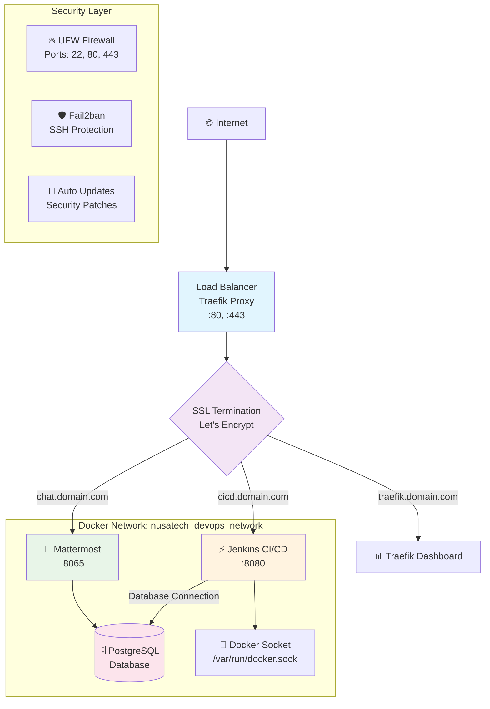
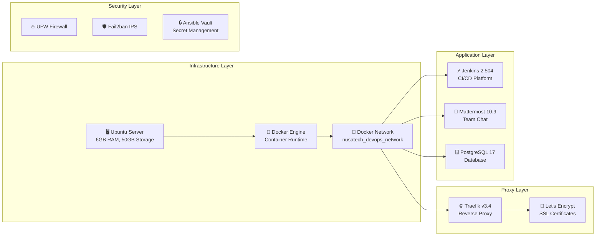
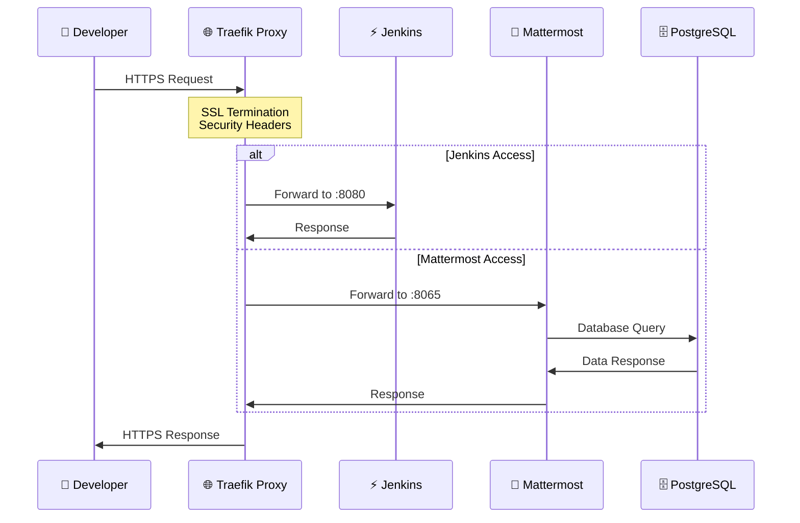
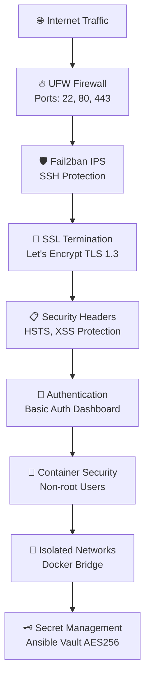
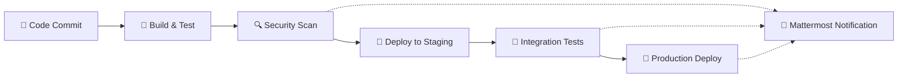

# Nusatech Development DevOps Stack
### Professional Infrastructure Automation Platform

---

## 📋 Executive Summary

Nusatech DevOps Stack adalah platform infrastruktur yang dirancang khusus untuk mendukung pengembangan perangkat lunak yang etis dan profesional. Platform ini mengintegrasikan teknologi terkini dengan praktik keamanan terbaik, memberikan solusi lengkap untuk CI/CD, kolaborasi tim, dan manajemen infrastruktur.

### Key Value Propositions

- **🚀 Deployment Otomatis** - Infrastructure as Code menggunakan Ansible
- **🔒 Keamanan Enterprise** - Multi-layer security dengan enkripsi end-to-end
- **⚡ High Performance** - Optimized untuk performa maksimal dengan resource terbatas
- **🌐 SSL/TLS Otomatis** - Certificate management dengan Let's Encrypt
- **📊 Monitoring Terintegrasi** - Real-time monitoring dan logging

---

## 🏗️ Arsitektur Sistem

### Network Architecture Diagram



### Service Architecture



### Data Flow Diagram



---

## 🛠️ Technology Stack

### Core Technologies

| Component | Technology | Version | Purpose |
|-----------|------------|---------|---------|
| **Container Runtime** | Docker Engine | Latest | Application containerization |
| **Orchestration** | Docker Compose | V2 | Service orchestration |
| **Reverse Proxy** | Traefik | v3.4.4 | Load balancing & SSL termination |
| **CI/CD Platform** | Jenkins | 2.504.3-LTS | Continuous integration & deployment |
| **Team Communication** | Mattermost | 10.9.1 | Team collaboration platform |
| **Database** | PostgreSQL | 17.5-Alpine | Relational database |
| **Automation** | Ansible | 2.9+ | Infrastructure as Code |

### Security Technologies

| Component | Technology | Purpose |
|-----------|------------|---------|
| **Firewall** | UFW (Uncomplicated Firewall) | Network security |
| **Intrusion Prevention** | Fail2ban | SSH brute force protection |
| **SSL/TLS** | Let's Encrypt | Automatic certificate management |
| **Secret Management** | Ansible Vault | Encrypted configuration |
| **Auto Updates** | Unattended Upgrades | Security patch management |

---

## 🚀 Installation Guide

### Prerequisites

#### System Requirements

```yaml
Minimum Server Specifications:
  - OS: Ubuntu 20.04+ / Debian 11+
  - RAM: 6GB (optimized configuration)
  - Storage: 50GB SSD
  - Network: Public IP address
  - Domain: Valid domain with DNS management access

Control Machine Requirements:
  - Ansible: 2.9+
  - Python: 3.8+
  - SSH: Key-based authentication
```

#### DNS Configuration

Sebelum instalasi, pastikan subdomain berikut mengarah ke IP server:

```bash
# Required DNS Records (A Records)
traefik.yourdomain.com  → YOUR_SERVER_IP
cicd.yourdomain.com     → YOUR_SERVER_IP  
chat.yourdomain.com     → YOUR_SERVER_IP
```

### Step-by-Step Installation

#### 1. Environment Setup

```bash
# Clone repository
git clone <repository-url>
cd nusatech-devops-stack

# Setup environment
make setup
```

#### 2. SSH Key Configuration

```bash
# Generate SSH key pair
ssh-keygen -t rsa -b 4096 -f ~/.ssh/summitethic-admin

# Copy public key to server
ssh-copy-id -i ~/.ssh/summitethic-admin.pub admin@YOUR_SERVER_IP

# Verify SSH connection
ssh -i ~/.ssh/summitethic-admin admin@YOUR_SERVER_IP
```

#### 3. Inventory Configuration

Edit file `inventory/hosts.yml`:

```yaml
---
all:
  children:
    devops_servers:
      hosts:
        nusatech-devops:
          ansible_host: YOUR_SERVER_IP
          ansible_user: admin
          ansible_ssh_private_key_file: ~/.ssh/summitethic-admin
      vars:
        ansible_python_interpreter: /usr/bin/python3
```

#### 4. Secret Configuration

```bash
# Edit encrypted vault
make edit-vault
```

Konfigurasi vault variables:

```yaml
# Domain configuration
vault_domain: "yourdomain.com"
vault_ssl_email: "admin@yourdomain.com"

# Service passwords
vault_traefik_admin_password: "your_secure_traefik_password"
vault_jenkins_admin_password: "your_secure_jenkins_password" 
vault_db_password: "your_secure_database_password"
```

#### 5. Deployment

```bash
# Test connectivity
make ping

# Deploy complete stack
make deploy

# Verify deployment
make status
```

---

## 🎛️ Operations & Management

### Daily Operations

#### Service Management

```bash
# Check all services status
make status

# Restart all services
make restart-services

# View service logs
make logs-traefik    # Traefik logs
make logs-jenkins    # Jenkins logs  
make logs-mattermost # Mattermost logs
```

#### Health Monitoring

```bash
# Security audit
make security-audit

# System connectivity test
make ping

# Check syntax before deployment
make check
```

### Maintenance Tasks

#### System Updates

```bash
# Update system packages
make update-system

# Clean temporary files
make clean

# Lint Ansible playbooks
make lint
```

#### Secret Management

```bash
# Edit encrypted secrets
make edit-vault

# Encrypt vault file
make encrypt

# Decrypt vault file (for backup)
make decrypt
```

### Deployment Options

#### Modular Deployment

```bash
# Deploy individual components
make deploy-container  # Docker installation only
make deploy-security   # Security configuration only
make deploy-proxy      # Traefik reverse proxy only
make deploy-cicd      # Jenkins & Mattermost only
```

#### Debug Mode

```bash
# Debug deployment with verbose output
make debug-full      # Full stack debug
make debug-container # Container debug
make debug-proxy     # Traefik debug
make debug-cicd      # CI/CD debug
```

---

## 🔒 Security Implementation

### Multi-Layer Security Architecture



### Security Features

#### Network Security
- **Minimal Attack Surface**: Hanya port 22, 80, 443 yang terbuka
- **Fail2ban Protection**: Automatic blocking untuk SSH brute force attacks
- **Container Isolation**: Isolated Docker networks untuk service communication

#### SSL/TLS Security
- **Automatic Certificate Management**: Let's Encrypt integration dengan renewal otomatis
- **TLS 1.3 Support**: Protocol terbaru untuk performa dan keamanan optimal
- **HSTS Headers**: Strict Transport Security untuk browser modern
- **Security Headers**: XSS protection, content type sniffing prevention

#### Access Control
- **SSH Key Authentication**: Password authentication disabled
- **Ansible Vault**: AES256 encryption untuk semua secrets
- **Basic Authentication**: Protected Traefik dashboard
- **Role-based Access**: Granular permission control

#### Container Security
- **Non-privileged Containers**: Menjalankan containers dengan user non-root
- **Read-only Filesystems**: Critical mounts dalam mode read-only
- **Security Contexts**: No new privileges flag untuk container security
- **Resource Limits**: Memory dan CPU limits untuk mencegah resource exhaustion

---

## 🚨 Troubleshooting Guide

### Common Issues & Solutions

#### SSH Connection Issues

```bash
# Problem: Permission denied (publickey)
# Solution: Check SSH key permissions
chmod 600 ~/.ssh/summitethic-admin
ssh-add ~/.ssh/summitethic-admin

# Test SSH connection
ssh -vvv -i ~/.ssh/summitethic-admin admin@YOUR_SERVER_IP
```

#### Docker Service Issues

```bash
# Problem: Docker containers not starting
# Check Docker daemon status
ansible all -i inventory/hosts.yml -m shell -a "systemctl status docker"

# Check container logs
make logs-<service-name>

# Restart Docker service
ansible all -i inventory/hosts.yml -m shell -a "systemctl restart docker" --become
```

#### SSL Certificate Issues

```bash
# Problem: Let's Encrypt certificate generation failed
# Check Traefik logs
make logs-traefik

# Verify DNS propagation
dig +short traefik.yourdomain.com
dig +short cicd.yourdomain.com
dig +short chat.yourdomain.com

# Manual certificate regeneration
ansible all -i inventory/hosts.yml -m shell -a "docker exec traefik rm -f /etc/traefik/acme.json"
make restart-services
```

#### Service Access Issues

```bash
# Problem: Services not accessible via domain
# Check service health
make status

# Verify Traefik routing
ansible all -i inventory/hosts.yml -m shell -a "docker logs traefik | grep -i error"

# Check internal connectivity
ansible all -i inventory/hosts.yml -m shell -a "docker exec traefik nslookup jenkins"
```

### Debug Commands

#### Comprehensive Diagnostics

```bash
# Full system diagnostic
make ping && make status && make security-audit

# Network diagnostics  
ansible all -i inventory/hosts.yml -m shell -a "netstat -tulpn | grep -E ':(80|443|8080|8065)'"

# Container diagnostics
ansible all -i inventory/hosts.yml -m shell -a "docker ps --format 'table {{.Names}}\t{{.Status}}\t{{.Ports}}'"

# Log analysis
ansible all -i inventory/hosts.yml -m shell -a "journalctl -u docker --since '1 hour ago' --no-pager"
```

---

## 📊 Post-Deployment Configuration

### Jenkins Initial Setup

#### 1. Access Jenkins Dashboard
```
URL: https://cicd.yourdomain.com
```

#### 2. Retrieve Initial Admin Password
```bash
# Get initial password from deployment output or run:
ansible all -i inventory/hosts.yml -m shell -a "docker exec jenkins cat /var/jenkins_home/secrets/initialAdminPassword"
```

#### 3. Essential Plugin Installation
```yaml
Recommended Plugins:
  - Docker Pipeline
  - GitLab Integration  
  - Blue Ocean UI
  - Build Timeout
  - Timestamper
  - Workspace Cleanup
  - Pipeline Stage View
  - Credentials Binding
```

#### 4. Global Tool Configuration
```yaml
Docker:
  - Name: docker
  - Installation: Install automatically from docker.com

Git:
  - Name: Default
  - Path: /usr/bin/git
```

### Mattermost Team Setup

#### 1. Access Mattermost
```
URL: https://chat.yourdomain.com
```

#### 2. System Admin Configuration
- Create system administrator account
- Configure team settings
- Set up user permissions
- Enable integrations

#### 3. Jenkins Integration
```yaml
Webhook Configuration:
  - URL: https://chat.yourdomain.com/hooks/[webhook-id]
  - Content-Type: application/json
  - Trigger: Build status changes
```

### Traefik Dashboard

#### 1. Access Dashboard
```
URL: https://traefik.yourdomain.com
Credentials: admin / [vault_traefik_admin_password]
```

#### 2. Monitor Services
- Real-time service status
- SSL certificate status
- Request metrics
- Error monitoring

---

## 📁 Project Structure

```
nusatech-devops-stack/
├── 📄 README.md                    # Project documentation
├── ⚙️ ansible.cfg                  # Ansible configuration
├── 🔨 Makefile                     # Automation commands
├── 📋 requirements.yml             # Ansible collections
├── 🎭 site.yml                     # Main deployment playbook
├── 🚫 .gitignore                   # Git ignore rules
│
├── 📂 inventory/
│   └── 🏠 hosts.yml               # Server inventory & connection details
│
├── 📂 group_vars/
│   ├── 🌍 all.yml                 # Global variables & configuration
│   └── 🔐 vault.yml               # Encrypted secrets (AES256)
│
├── 📂 playbooks/                   # Ansible playbooks
│   ├── 🐳 container.yml           # Docker installation & configuration
│   ├── 🔒 security.yml            # Security hardening (UFW, Fail2ban)
│   ├── 🌐 proxy.yml               # Traefik reverse proxy deployment
│   └── ⚡ cicd.yml                # Jenkins & Mattermost deployment
│
└── 📂 roles/                       # Ansible roles
    ├── 📂 container/               # Docker role
    │   ├── 📂 tasks/
    │   │   └── main.yml           # Docker installation tasks
    │   └── 📂 handlers/
    │       └── main.yml           # Docker service handlers
    │
    ├── 📂 security/                # Security role
    │   └── 📂 tasks/
    │       └── main.yml           # Security configuration tasks
    │
    ├── 📂 proxy/                   # Traefik role
    │   ├── 📂 tasks/
    │   │   └── main.yml           # Traefik deployment tasks
    │   └── 📂 templates/
    │       ├── traefik.yml.j2     # Traefik main configuration
    │       ├── dynamic.yml.j2     # Dynamic configuration
    │       └── traefik-compose.yml.j2  # Docker Compose template
    │
    └── 📂 cicd/                    # CI/CD role
        ├── 📂 tasks/
        │   └── main.yml           # Jenkins & Mattermost deployment
        └── 📂 templates/
            └── cicd-compose.yml.j2 # CI/CD Docker Compose template
```

---

## 🔄 DevOps Best Practices

### Infrastructure as Code (IaC)

#### Version Control
- Semua konfigurasi disimpan dalam Git repository
- Branching strategy untuk development dan production
- Pull request review untuk perubahan infrastruktur
- Tag versioning untuk release management

#### Configuration Management
- Ansible untuk automation dan consistency
- Idempotent playbooks untuk reliable deployments
- Variable separation untuk different environments
- Secret management dengan Ansible Vault

### Continuous Integration/Continuous Deployment

#### CI/CD Pipeline Design


#### Quality Gates
- Automated testing pada setiap commit
- Security scanning untuk dependencies
- Code quality metrics dengan SonarQube integration
- Performance testing untuk critical services

### Monitoring & Observability

#### Key Metrics
```yaml
Infrastructure Metrics:
  - CPU & Memory utilization
  - Disk space & I/O performance
  - Network latency & throughput
  - Container resource usage

Application Metrics:
  - Service availability & uptime
  - Response time & latency
  - Error rates & status codes
  - User activity & engagement

Security Metrics:
  - Failed authentication attempts
  - Firewall blocked connections
  - SSL certificate expiry dates
  - Security scan results
```

---

## 🤝 Contributing & Development

### Development Workflow

#### 1. Local Development Setup
```bash
# Fork repository
git fork nusatech-devops-stack

# Clone forked repository
git clone https://github.com/your-username/nusatech-devops-stack.git

# Create development branch
git checkout -b feature/your-feature-name
```

#### 2. Testing Changes
```bash
# Test syntax
make check

# Test deployment on development server
make deploy-container  # Test individual components
make deploy-security
make deploy-proxy
make deploy-cicd

# Full integration test
make deploy
```

#### 3. Code Standards
- Follow Ansible best practices dan naming conventions
- Gunakan meaningful variable names dan task descriptions
- Implement proper error handling dan rollback mechanisms
- Document complex configurations dengan inline comments
- Maintain idempotency untuk semua automation tasks

#### 4. Security Guidelines
- Never commit plain text secrets atau passwords
- Use Ansible Vault untuk semua sensitive information
- Implement least privilege principle untuk service accounts
- Regular security audits dan dependency updates
- Follow secure coding practices untuk custom scripts

### Quality Assurance

#### Pre-commit Checklist
- [ ] Syntax validation dengan `make check`
- [ ] Linting dengan `make lint`
- [ ] Security scan untuk new dependencies
- [ ] Documentation updates untuk configuration changes
- [ ] Testing pada clean environment

#### Code Review Process
- Peer review untuk semua infrastructure changes
- Security review untuk privilege escalation changes
- Performance impact assessment untuk resource changes
- Rollback plan untuk critical system modifications

---

## 📞 Support & Documentation

### Internal Documentation
- **Ansible Playbook Documentation**: Inline comments dan task descriptions
- **Configuration Reference**: Variable definitions dan default values
- **Operational Runbooks**: Step-by-step procedures untuk common tasks
- **Security Policies**: Guidelines untuk secure configuration management

### External Resources
- **Ansible Documentation**: https://docs.ansible.com/
- **Docker Documentation**: https://docs.docker.com/
- **Traefik Documentation**: https://doc.traefik.io/traefik/
- **Jenkins Documentation**: https://www.jenkins.io/doc/
- **Mattermost Documentation**: https://docs.mattermost.com/

### Community Support
- Submit issues via project repository dengan detailed problem description
- Contribute improvements via pull requests dengan proper testing
- Follow semantic versioning untuk release management
- Maintain backward compatibility untuk configuration changes

### Emergency Contacts
```yaml
Emergency Response:
  - Infrastructure Issues: DevOps Team Lead
  - Security Incidents: Security Officer
  - Application Issues: Development Team Lead
  - Business Impact: Project Manager

Escalation Matrix:
  - Level 1: Team Member (0-2 hours)
  - Level 2: Team Lead (2-4 hours)  
  - Level 3: Department Head (4+ hours)
```

---

## 📋 Appendix

### Environment Variables Reference

```yaml
# Global Configuration
project_name: nusatech-devops           # Project identifier
docker_network: nusatech_devops_network # Docker network name
base_dir: /opt/nusatech-devops         # Base installation directory

# Service Configuration
services:
  traefik:
    dashboard_port: 8080               # Internal dashboard port
  jenkins:
    port: 8080                        # Internal service port
    admin_user: admin                 # Default admin username
  mattermost:
    port: 8065                        # Internal service port
    max_users: 50                     # Team size limit

# Security Configuration
firewall_enabled: true                # Enable UFW firewall
fail2ban_enabled: true               # Enable SSH protection
auto_updates_enabled: true           # Enable automatic security updates
```

### Port Reference

| Service | Internal Port | External Port | Protocol | Purpose |
|---------|---------------|---------------|----------|---------|
| SSH | 22 | 22 | TCP | Server administration |
| Traefik HTTP | 80 | 80 | TCP | HTTP redirect to HTTPS |
| Traefik HTTPS | 443 | 443 | TCP | HTTPS traffic |
| Jenkins | 8080 | N/A | TCP | CI/CD web interface |
| Mattermost | 8065 | N/A | TCP | Team chat interface |
| PostgreSQL | 5432 | N/A | TCP | Database connection |

### SSL Certificate Management

```yaml
Certificate Configuration:
  Provider: Let's Encrypt
  Challenge Type: HTTP-01
  Renewal: Automatic (30 days before expiry)
  Storage: /etc/traefik/acme.json
  
Supported Domains:
  - traefik.yourdomain.com
  - cicd.yourdomain.com
  - chat.yourdomain.com
```

---

**© 2024 Nusatech Development - Built with ❤️ for Ethical Software Development**

*Dokumentasi ini dirancang untuk mendukung pengembangan perangkat lunak yang etis, aman, dan berkelanjutan. Semua implementasi mengikuti best practices industri dan standar keamanan internasional.*