# Nusatech Development DevOps Stack
### Professional Infrastructure Automation Platform

---

## 📋 Executive Summary

Nusatech DevOps Stack adalah platform infrastruktur yang dirancang khusus untuk mendukung pengembangan perangkat lunak yang etis dan profesional. Platform ini mengintegrasikan teknologi terkini dengan praktik keamanan terbaik, memberikan solusi lengkap untuk CI/CD, kolaborasi tim, dan manajemen infrastruktur.

### Key Value Propositions

- **🚀 Deployment Otomatis** - Infrastructure as Code menggunakan Ansible
- **🔒 Keamanan Enterprise** - Multi-layer security dengan enkripsi end-to-end
- **⚡ High Performance** - Optimized untuk performa maksimal dengan resource terbatas
- **🌐 SSL/TLS Otomatis** - Certificate management dengan Let's Encrypt
- **📊 Monitoring Terintegrasi** - Real-time monitoring dan logging

---

## 🏗️ Arsitektur Sistem

### Network Architecture Diagram


*Gambar di atas menunjukkan arsitektur lengkap sistem Nusatech DevOps Stack dengan detail flow traffic dari Internet hingga ke individual services.*

#### Arsitektur Flow Detail:

```mermaid
graph TB
    subgraph "Security Layer"
        UFW[🔥 UFW Firewall<br/>Ports: 22, 80, 443]
        Fail2ban[🛡️ Fail2ban<br/>SSH Protection]  
        AutoUpdate[🔄 Auto Updates<br/>Security Patches]
    end
    
    Internet[🌐 Internet] --> LB[Load Balancer<br/>Traefik Proxy<br/>:80, :443]
    
    LB --> SSL{SSL Termination<br/>Let's Encrypt}
    
    SSL --> |chat.domain.com| Mattermost[💬 Mattermost<br/>:8065]
    SSL --> |cicd.domain.com| Jenkins[⚡ Jenkins CI/CD<br/>:8080]
    SSL --> |traefik.domain.com| Dashboard[📊 Traefik Dashboard]
    
    subgraph "Docker Network: nusatech_devops_network"
        Mattermost --> |Database Connection| PostgreSQL[(🗄️ PostgreSQL<br/>Database)]
        Jenkins --> PostgreSQL
        Jenkins --> DockerSocket[🐳 Docker Socket<br/>/var/run/docker.sock]
    end
    
    style LB fill:#e1f5fe
    style SSL fill:#f3e5f5
    style Jenkins fill:#fff3e0
    style Mattermost fill:#e8f5e8
    style PostgreSQL fill:#fce4ec
    style Dashboard fill:#f0f4c3
```



#### Komponen Arsitektur:

**🔒 Security Layer**
- **UFW Firewall**: Mengizinkan hanya port 22 (SSH), 80 (HTTP), dan 443 (HTTPS)
- **Fail2ban**: Perlindungan terhadap brute force attacks pada SSH
- **Auto Updates**: Pembaruan keamanan otomatis untuk sistem operasi

**🌐 Traffic Flow**
- Internet traffic masuk melalui Traefik Proxy pada port 80/443
- SSL termination menggunakan sertifikat Let's Encrypt
- Routing berdasarkan subdomain ke service yang sesuai

**🐳 Docker Network**
- Semua services berjalan dalam isolated Docker network
- Database sharing antara Jenkins dan Mattermost
- Docker socket mounting untuk Jenkins CI/CD operations

### Service Architecture


*Diagram di atas menunjukkan arsitektur berlapis (layered architecture) dari Nusatech DevOps Stack dengan pemisahan yang jelas antara Security, Infrastructure, Application, dan Proxy layers.*

#### Layered Architecture Detail:

```mermaid
graph LR
    subgraph "Security Layer"
        UFW[🔥 UFW Firewall]
        Fail2ban[🛡️ Fail2ban IPS]
        Vault[🔐 Ansible Vault<br/>Secret Management]
    end
    
    subgraph "Infrastructure Layer"
        Ubuntu[🖥️ Ubuntu Server<br/>6GB RAM, 50GB Storage]
        Docker[🐳 Docker Engine<br/>Container Runtime]
        Network[🔗 Docker Network<br/>nusatech_devops_network]
    end
    
    subgraph "Application Layer"
        Jenkins[⚡ Jenkins 2.504<br/>CI/CD Platform]
        Mattermost[💬 Mattermost 10.9<br/>Team Chat]
        PostgreSQL[🗄️ PostgreSQL 17<br/>Database]
    end
    
    subgraph "Proxy Layer"
        Traefik[🌐 Traefik v3.4<br/>Reverse Proxy]
        LetsEncrypt[🔐 Let's Encrypt<br/>SSL Certificates]
    end
    
    Ubuntu --> Docker
    Docker --> Network
    Network --> Jenkins
    Network --> Mattermost
    Network --> PostgreSQL
    Network --> Traefik
    Traefik --> LetsEncrypt
```



#### Karakteristik Layer:

**🔒 Security Layer**
- **UFW Firewall**: Network-level protection dengan minimal port exposure
- **Fail2ban IPS**: Intrusion Prevention System untuk SSH protection
- **Ansible Vault**: Encrypted secret management dengan AES256

**🏗️ Infrastructure Layer**
- **Ubuntu Server**: Optimized untuk 6GB RAM dan 50GB storage
- **Docker Engine**: Container runtime dengan logging configuration
- **Docker Network**: Isolated network untuk inter-service communication

**📱 Application Layer**
- **Jenkins 2.504**: CI/CD platform dengan Docker support
- **Mattermost 10.9**: Team collaboration platform
- **PostgreSQL 17**: High-performance database backend

**🌐 Proxy Layer**
- **Traefik v3.4**: Modern reverse proxy dengan service discovery
- **Let's Encrypt**: Automatic SSL certificate management

### Data Flow Diagram


*Diagram di atas menunjukkan alur data lengkap dari Developer melalui Traefik Proxy ke berbagai services, termasuk interaksi database dan response flow yang detail.*

#### Detailed Sequence Flow:

```mermaid
sequenceDiagram
    participant Dev as 👤 Developer
    participant Traefik as 🌐 Traefik Proxy
    participant Jenkins as ⚡ Jenkins
    participant Mattermost as 💬 Mattermost
    participant DB as 🗄️ PostgreSQL
    
    Dev->>Traefik: HTTPS Request
    Note over Traefik: SSL Termination<br/>Security Headers
    
    alt Jenkins Access (cicd.domain.com)
        Traefik->>Jenkins: Forward to :8080
        Note over Jenkins: CI/CD Operations<br/>Build & Deploy
        Jenkins->>Traefik: Response
    else Mattermost Access (chat.domain.com)
        Traefik->>Mattermost: Forward to :8065
        Note over Mattermost: Team Chat<br/>User Authentication
        Mattermost->>DB: Database Query
        Note over DB: User Data<br/>Chat Messages<br/>Team Settings
        DB->>Mattermost: Data Response
        Mattermost->>Traefik: Response
    end
    
    Traefik->>Dev: HTTPS Response
    Note over Dev: Secured Content<br/>with TLS 1.3
```



#### Request Flow Analysis:

**🔐 SSL Termination & Security**
- HTTPS requests diterima oleh Traefik pada port 443
- SSL termination dengan Let's Encrypt certificates
- Security headers ditambahkan (HSTS, XSS Protection, etc.)
- Request routing berdasarkan subdomain

**⚡ Jenkins Flow (cicd.domain.com)**
- Direct forwarding ke Jenkins container port 8080
- CI/CD operations: build, test, deploy
- Docker socket access untuk container operations
- Response dengan build status dan logs

**💬 Mattermost Flow (chat.domain.com)**
- Forwarding ke Mattermost container port 8065
- Database interaction untuk user authentication
- Chat message persistence dan retrieval
- Real-time team collaboration features

---

## 🛠️ Technology Stack

### Core Technologies

| Component | Technology | Version | Purpose |
|-----------|------------|---------|---------|
| **Container Runtime** | Docker Engine | Latest | Application containerization |
| **Orchestration** | Docker Compose | V2 | Service orchestration |
| **Reverse Proxy** | Traefik | v3.4.4 | Load balancing & SSL termination |
| **CI/CD Platform** | Jenkins | 2.504.3-LTS | Continuous integration & deployment |
| **Team Communication** | Mattermost | 10.9.1 | Team collaboration platform |
| **Database** | PostgreSQL | 17.5-Alpine | Relational database |
| **Automation** | Ansible | 2.9+ | Infrastructure as Code |

### Security Technologies

| Component | Technology | Purpose |
|-----------|------------|---------|
| **Firewall** | UFW (Uncomplicated Firewall) | Network security |
| **Intrusion Prevention** | Fail2ban | SSH brute force protection |
| **SSL/TLS** | Let's Encrypt | Automatic certificate management |
| **Secret Management** | Ansible Vault | Encrypted configuration |
| **Auto Updates** | Unattended Upgrades | Security patch management |

---

## 🚀 Installation Guide

### Prerequisites

#### System Requirements

```yaml
Minimum Server Specifications:
  - OS: Ubuntu 20.04+ / Debian 11+
  - RAM: 6GB (optimized configuration)
  - Storage: 50GB SSD
  - Network: Public IP address
  - Domain: Valid domain with DNS management access

Control Machine Requirements:
  - Ansible: 2.9+
  - Python: 3.8+
  - SSH: Key-based authentication
```

#### DNS Configuration

Sebelum instalasi, pastikan subdomain berikut mengarah ke IP server:

```bash
# Required DNS Records (A Records)
traefik.yourdomain.com  → YOUR_SERVER_IP
cicd.yourdomain.com     → YOUR_SERVER_IP  
chat.yourdomain.com     → YOUR_SERVER_IP
```

### Step-by-Step Installation

#### 1. Environment Setup

```bash
# Clone repository
git clone <repository-url>
cd nusatech-devops-stack

# Setup environment
make setup
```

#### 2. SSH Key Configuration

```bash
# Generate SSH key pair
ssh-keygen -t rsa -b 4096 -f ~/.ssh/summitethic-admin

# Copy public key to server
ssh-copy-id -i ~/.ssh/summitethic-admin.pub admin@YOUR_SERVER_IP

# Verify SSH connection
ssh -i ~/.ssh/summitethic-admin admin@YOUR_SERVER_IP
```

#### 3. Inventory Configuration

Edit file `inventory/hosts.yml`:

```yaml
---
all:
  children:
    devops_servers:
      hosts:
        nusatech-devops:
          ansible_host: YOUR_SERVER_IP
          ansible_user: admin
          ansible_ssh_private_key_file: ~/.ssh/summitethic-admin
      vars:
        ansible_python_interpreter: /usr/bin/python3
```

#### 4. Secret Configuration

```bash
# Edit encrypted vault
make edit-vault
```

Konfigurasi vault variables:

```yaml
# Domain configuration
vault_domain: "yourdomain.com"
vault_ssl_email: "admin@yourdomain.com"

# Service passwords
vault_traefik_admin_password: "your_secure_traefik_password"
vault_jenkins_admin_password: "your_secure_jenkins_password" 
vault_db_password: "your_secure_database_password"
```

#### 5. Deployment

```bash
# Test connectivity
make ping

# Deploy complete stack
make deploy

# Verify deployment
make status
```

---

## 🎛️ Operations & Management

### Daily Operations

#### Service Management

```bash
# Check all services status
make status

# Restart all services
make restart-services

# View service logs
make logs-traefik    # Traefik logs
make logs-jenkins    # Jenkins logs  
make logs-mattermost # Mattermost logs
```

#### Health Monitoring

```bash
# Security audit
make security-audit

# System connectivity test
make ping

# Check syntax before deployment
make check
```

### Maintenance Tasks

#### System Updates

```bash
# Update system packages
make update-system

# Clean temporary files
make clean

# Lint Ansible playbooks
make lint
```

#### Secret Management

```bash
# Edit encrypted secrets
make edit-vault

# Encrypt vault file
make encrypt

# Decrypt vault file (for backup)
make decrypt
```

### Deployment Options

#### Modular Deployment

```bash
# Deploy individual components
make deploy-container  # Docker installation only
make deploy-security   # Security configuration only
make deploy-proxy      # Traefik reverse proxy only
make deploy-cicd      # Jenkins & Mattermost only
```

#### Debug Mode

```bash
# Debug deployment with verbose output
make debug-full      # Full stack debug
make debug-container # Container debug
make debug-proxy     # Traefik debug
make debug-cicd      # CI/CD debug
```

---

## 🔒 Security Implementation

### Multi-Layer Security Architecture


*Diagram di atas menunjukkan implementasi Defense in Depth dengan 8 layer keamanan bertingkat, dari Internet Traffic hingga Secret Management level.*

#### Security Flow Visualization:

```mermaid
graph TD
    Internet[🌐 Internet Traffic] --> Firewall[🔥 UFW Firewall<br/>Ports: 22, 80, 443]
    
    Firewall --> IPS[🛡️ Fail2ban IPS<br/>SSH Protection]
    
    IPS --> SSL[🔐 SSL Termination<br/>Let's Encrypt TLS 1.3]
    
    SSL --> Headers[📋 Security Headers<br/>HSTS, XSS Protection]
    
    Headers --> Auth[🔑 Authentication<br/>Basic Auth Dashboard]
    
    Auth --> Container[🐳 Container Security<br/>Non-root Users]
    
    Container --> Network[🔗 Isolated Networks<br/>Docker Bridge]
    
    Network --> Secrets[🗝️ Secret Management<br/>Ansible Vault AES256]
    
    style Internet fill:#ffcdd2
    style Firewall fill:#f8bbd9
    style IPS fill:#e1bee7
    style SSL fill:#c5cae9
    style Headers fill:#bbdefb
    style Auth fill:#b2dfdb
    style Container fill:#c8e6c9
    style Network fill:#dcedc8
    style Secrets fill:#f0f4c3
```



#### Defense in Depth Layers:

**Layer 1: 🔥 Network Perimeter (UFW Firewall)**
- Minimal attack surface dengan hanya 3 port terbuka
- Stateful packet inspection
- Default deny policy untuk incoming connections

**Layer 2: 🛡️ Intrusion Prevention (Fail2ban IPS)**
- Real-time SSH brute force detection
- Automatic IP blocking untuk suspicious activities
- Configurable ban time dan retry thresholds

**Layer 3: 🔐 Transport Security (SSL Termination)**
- TLS 1.3 dengan Let's Encrypt certificates
- Automatic certificate renewal
- Perfect Forward Secrecy (PFS) support

**Layer 4: 📋 Application Security (Security Headers)**
- HTTP Strict Transport Security (HSTS)
- Cross-Site Scripting (XSS) protection
- Content Type sniffing prevention
- Clickjacking protection via X-Frame-Options

**Layer 5: 🔑 Access Control (Authentication)**
- Basic authentication untuk Traefik dashboard
- Strong password policies
- Session management dan timeout

**Layer 6: 🐳 Container Security (Non-root Users)**
- Principle of least privilege
- Non-privileged container execution
- Read-only filesystems where applicable
- Resource limits dan quotas

**Layer 7: 🔗 Network Isolation (Docker Bridge)**
- Isolated Docker networks
- Service-to-service communication control
- Network segmentation untuk different tiers

**Layer 8: 🗝️ Secret Management (Ansible Vault)**
- AES256 encryption untuk sensitive data
- Centralized secret management
- Encryption at rest untuk configuration files

### Security Features

#### Network Security
- **Minimal Attack Surface**: Hanya port 22, 80, 443 yang terbuka
- **Fail2ban Protection**: Automatic blocking untuk SSH brute force attacks
- **Container Isolation**: Isolated Docker networks untuk service communication

#### SSL/TLS Security
- **Automatic Certificate Management**: Let's Encrypt integration dengan renewal otomatis
- **TLS 1.3 Support**: Protocol terbaru untuk performa dan keamanan optimal
- **HSTS Headers**: Strict Transport Security untuk browser modern
- **Security Headers**: XSS protection, content type sniffing prevention

#### Access Control
- **SSH Key Authentication**: Password authentication disabled
- **Ansible Vault**: AES256 encryption untuk semua secrets
- **Basic Authentication**: Protected Traefik dashboard
- **Role-based Access**: Granular permission control

#### Container Security
- **Non-privileged Containers**: Menjalankan containers dengan user non-root
- **Read-only Filesystems**: Critical mounts dalam mode read-only
- **Security Contexts**: No new privileges flag untuk container security
- **Resource Limits**: Memory dan CPU limits untuk mencegah resource exhaustion

---

## 🚨 Troubleshooting Guide

### Common Issues & Solutions

#### SSH Connection Issues

```bash
# Problem: Permission denied (publickey)
# Solution: Check SSH key permissions
chmod 600 ~/.ssh/summitethic-admin
ssh-add ~/.ssh/summitethic-admin

# Test SSH connection
ssh -vvv -i ~/.ssh/summitethic-admin admin@YOUR_SERVER_IP
```

#### Docker Service Issues

```bash
# Problem: Docker containers not starting
# Check Docker daemon status
ansible all -i inventory/hosts.yml -m shell -a "systemctl status docker"

# Check container logs
make logs-<service-name>

# Restart Docker service
ansible all -i inventory/hosts.yml -m shell -a "systemctl restart docker" --become
```

#### SSL Certificate Issues

```bash
# Problem: Let's Encrypt certificate generation failed
# Check Traefik logs
make logs-traefik

# Verify DNS propagation
dig +short traefik.yourdomain.com
dig +short cicd.yourdomain.com
dig +short chat.yourdomain.com

# Manual certificate regeneration
ansible all -i inventory/hosts.yml -m shell -a "docker exec traefik rm -f /etc/traefik/acme.json"
make restart-services
```

#### Service Access Issues

```bash
# Problem: Services not accessible via domain
# Check service health
make status

# Verify Traefik routing
ansible all -i inventory/hosts.yml -m shell -a "docker logs traefik | grep -i error"

# Check internal connectivity
ansible all -i inventory/hosts.yml -m shell -a "docker exec traefik nslookup jenkins"
```

### Debug Commands

#### Comprehensive Diagnostics

```bash
# Full system diagnostic
make ping && make status && make security-audit

# Network diagnostics  
ansible all -i inventory/hosts.yml -m shell -a "netstat -tulpn | grep -E ':(80|443|8080|8065)'"

# Container diagnostics
ansible all -i inventory/hosts.yml -m shell -a "docker ps --format 'table {{.Names}}\t{{.Status}}\t{{.Ports}}'"

# Log analysis
ansible all -i inventory/hosts.yml -m shell -a "journalctl -u docker --since '1 hour ago' --no-pager"
```

---

## 📊 Post-Deployment Configuration

### Jenkins Initial Setup

#### 1. Access Jenkins Dashboard
```
URL: https://cicd.yourdomain.com
```

#### 2. Retrieve Initial Admin Password
```bash
# Get initial password from deployment output or run:
ansible all -i inventory/hosts.yml -m shell -a "docker exec jenkins cat /var/jenkins_home/secrets/initialAdminPassword"
```

#### 3. Essential Plugin Installation
```yaml
Recommended Plugins:
  - Docker Pipeline
  - GitLab Integration  
  - Blue Ocean UI
  - Build Timeout
  - Timestamper
  - Workspace Cleanup
  - Pipeline Stage View
  - Credentials Binding
```

#### 4. Global Tool Configuration
```yaml
Docker:
  - Name: docker
  - Installation: Install automatically from docker.com

Git:
  - Name: Default
  - Path: /usr/bin/git
```

### Mattermost Team Setup

#### 1. Access Mattermost
```
URL: https://chat.yourdomain.com
```

#### 2. System Admin Configuration
- Create system administrator account
- Configure team settings
- Set up user permissions
- Enable integrations

#### 3. Jenkins Integration
```yaml
Webhook Configuration:
  - URL: https://chat.yourdomain.com/hooks/[webhook-id]
  - Content-Type: application/json
  - Trigger: Build status changes
```

### Traefik Dashboard

#### 1. Access Dashboard
```
URL: https://traefik.yourdomain.com
Credentials: admin / [vault_traefik_admin_password]
```

#### 2. Monitor Services
- Real-time service status
- SSL certificate status
- Request metrics
- Error monitoring

---

## 📁 Project Structure

```
nusatech-devops-stack/
├── 📄 README.md                    # Project documentation
├── ⚙️ ansible.cfg                  # Ansible configuration
├── 🔨 Makefile                     # Automation commands
├── 📋 requirements.yml             # Ansible collections
├── 🎭 site.yml                     # Main deployment playbook
├── 🚫 .gitignore                   # Git ignore rules
│
├── 📂 inventory/
│   └── 🏠 hosts.yml               # Server inventory & connection details
│
├── 📂 group_vars/
│   ├── 🌍 all.yml                 # Global variables & configuration
│   └── 🔐 vault.yml               # Encrypted secrets (AES256)
│
├── 📂 playbooks/                   # Ansible playbooks
│   ├── 🐳 container.yml           # Docker installation & configuration
│   ├── 🔒 security.yml            # Security hardening (UFW, Fail2ban)
│   ├── 🌐 proxy.yml               # Traefik reverse proxy deployment
│   └── ⚡ cicd.yml                # Jenkins & Mattermost deployment
│
└── 📂 roles/                       # Ansible roles
    ├── 📂 container/               # Docker role
    │   ├── 📂 tasks/
    │   │   └── main.yml           # Docker installation tasks
    │   └── 📂 handlers/
    │       └── main.yml           # Docker service handlers
    │
    ├── 📂 security/                # Security role
    │   └── 📂 tasks/
    │       └── main.yml           # Security configuration tasks
    │
    ├── 📂 proxy/                   # Traefik role
    │   ├── 📂 tasks/
    │   │   └── main.yml           # Traefik deployment tasks
    │   └── 📂 templates/
    │       ├── traefik.yml.j2     # Traefik main configuration
    │       ├── dynamic.yml.j2     # Dynamic configuration
    │       └── traefik-compose.yml.j2  # Docker Compose template
    │
    └── 📂 cicd/                    # CI/CD role
        ├── 📂 tasks/
        │   └── main.yml           # Jenkins & Mattermost deployment
        └── 📂 templates/
            └── cicd-compose.yml.j2 # CI/CD Docker Compose template
```

---

## 🔄 DevOps Best Practices

### Infrastructure as Code (IaC)

#### Version Control
- Semua konfigurasi disimpan dalam Git repository
- Branching strategy untuk development dan production
- Pull request review untuk perubahan infrastruktur
- Tag versioning untuk release management

#### Configuration Management
- Ansible untuk automation dan consistency
- Idempotent playbooks untuk reliable deployments
- Variable separation untuk different environments
- Secret management dengan Ansible Vault

### Continuous Integration/Continuous Deployment

#### CI/CD Pipeline Design


*Diagram di atas menunjukkan alur CI/CD pipeline lengkap dari Code Commit hingga Production Deploy dengan integrasi Mattermost notifications untuk setiap tahap critical.*

#### Pipeline Flow Visualization:

```mermaid
graph LR
    Code[📝 Code Commit] --> Build[🔨 Build & Test]
    Build --> Security[🔍 Security Scan]
    Security --> Deploy[🚀 Deploy to Staging]
    Deploy --> Test[🧪 Integration Tests]
    Test --> Prod[🌟 Production Deploy]
    
    Security -.-> Notify[📢 Mattermost Notification]
    Test -.-> Notify
    Prod -.-> Notify
    
    style Code fill:#e3f2fd
    style Build fill:#f3e5f5
    style Security fill:#fff3e0
    style Deploy fill:#e8f5e8
    style Test fill:#fce4ec
    style Prod fill:#f0f4c3
    style Notify fill:#ffecb3
```



#### Pipeline Stages Detail:

**📝 Stage 1: Code Commit**
- Git webhook triggers dari repository
- Automatic branch detection dan validation
- Code quality pre-checks

**🔨 Stage 2: Build & Test**
- Docker image building dengan multi-stage builds
- Unit testing dan code coverage analysis
- Artifact generation dan tagging

**🔍 Stage 3: Security Scan**
- Dependency vulnerability scanning
- Container image security analysis
- SAST (Static Application Security Testing)
- **🔔 Notification**: Security scan results ke Mattermost

**🚀 Stage 4: Deploy to Staging**
- Automated deployment ke staging environment
- Environment configuration validation
- Health check verification

**🧪 Stage 5: Integration Tests**
- End-to-end testing pada staging environment
- API testing dan performance validation
- User acceptance testing (UAT)
- **🔔 Notification**: Test results dan coverage reports

**🌟 Stage 6: Production Deploy**
- Blue-green deployment strategy
- Zero-downtime deployment
- Post-deployment validation
- **🔔 Notification**: Deployment status dan metrics

#### Notification Integration:
- **Real-time Alerts**: Critical failures dan security issues
- **Status Updates**: Build progress dan deployment status  
- **Team Collaboration**: Code review requests dan approvals
- **Metrics Reporting**: Performance dan quality metrics

#### Quality Gates
- Automated testing pada setiap commit
- Security scanning untuk dependencies
- Code quality metrics dengan SonarQube integration
- Performance testing untuk critical services

### Monitoring & Observability

#### Key Metrics
```yaml
Infrastructure Metrics:
  - CPU & Memory utilization
  - Disk space & I/O performance
  - Network latency & throughput
  - Container resource usage

Application Metrics:
  - Service availability & uptime
  - Response time & latency
  - Error rates & status codes
  - User activity & engagement

Security Metrics:
  - Failed authentication attempts
  - Firewall blocked connections
  - SSL certificate expiry dates
  - Security scan results
```

---

## 🤝 Contributing & Development

### Development Workflow

#### 1. Local Development Setup
```bash
# Fork repository
git fork nusatech-devops-stack

# Clone forked repository
git clone https://github.com/your-username/nusatech-devops-stack.git

# Create development branch
git checkout -b feature/your-feature-name
```

#### 2. Testing Changes
```bash
# Test syntax
make check

# Test deployment on development server
make deploy-container  # Test individual components
make deploy-security
make deploy-proxy
make deploy-cicd

# Full integration test
make deploy
```

#### 3. Code Standards
- Follow Ansible best practices dan naming conventions
- Gunakan meaningful variable names dan task descriptions
- Implement proper error handling dan rollback mechanisms
- Document complex configurations dengan inline comments
- Maintain idempotency untuk semua automation tasks

#### 4. Security Guidelines
- Never commit plain text secrets atau passwords
- Use Ansible Vault untuk semua sensitive information
- Implement least privilege principle untuk service accounts
- Regular security audits dan dependency updates
- Follow secure coding practices untuk custom scripts

### Quality Assurance

#### Pre-commit Checklist
- [ ] Syntax validation dengan `make check`
- [ ] Linting dengan `make lint`
- [ ] Security scan untuk new dependencies
- [ ] Documentation updates untuk configuration changes
- [ ] Testing pada clean environment

#### Code Review Process
- Peer review untuk semua infrastructure changes
- Security review untuk privilege escalation changes
- Performance impact assessment untuk resource changes
- Rollback plan untuk critical system modifications

---

## 📞 Support & Documentation

### Internal Documentation
- **Ansible Playbook Documentation**: Inline comments dan task descriptions
- **Configuration Reference**: Variable definitions dan default values
- **Operational Runbooks**: Step-by-step procedures untuk common tasks
- **Security Policies**: Guidelines untuk secure configuration management

### External Resources
- **Ansible Documentation**: https://docs.ansible.com/
- **Docker Documentation**: https://docs.docker.com/
- **Traefik Documentation**: https://doc.traefik.io/traefik/
- **Jenkins Documentation**: https://www.jenkins.io/doc/
- **Mattermost Documentation**: https://docs.mattermost.com/

### Community Support
- Submit issues via project repository dengan detailed problem description
- Contribute improvements via pull requests dengan proper testing
- Follow semantic versioning untuk release management
- Maintain backward compatibility untuk configuration changes

### Emergency Contacts
```yaml
Emergency Response:
  - Infrastructure Issues: DevOps Team Lead
  - Security Incidents: Security Officer
  - Application Issues: Development Team Lead
  - Business Impact: Project Manager

Escalation Matrix:
  - Level 1: Team Member (0-2 hours)
  - Level 2: Team Lead (2-4 hours)  
  - Level 3: Department Head (4+ hours)
```

---

## 📋 Appendix

### Environment Variables Reference

```yaml
# Global Configuration
project_name: nusatech-devops           # Project identifier
docker_network: nusatech_devops_network # Docker network name
base_dir: /opt/nusatech-devops         # Base installation directory

# Service Configuration
services:
  traefik:
    dashboard_port: 8080               # Internal dashboard port
  jenkins:
    port: 8080                        # Internal service port
    admin_user: admin                 # Default admin username
  mattermost:
    port: 8065                        # Internal service port
    max_users: 50                     # Team size limit

# Security Configuration
firewall_enabled: true                # Enable UFW firewall
fail2ban_enabled: true               # Enable SSH protection
auto_updates_enabled: true           # Enable automatic security updates
```

### Port Reference

| Service | Internal Port | External Port | Protocol | Purpose |
|---------|---------------|---------------|----------|---------|
| SSH | 22 | 22 | TCP | Server administration |
| Traefik HTTP | 80 | 80 | TCP | HTTP redirect to HTTPS |
| Traefik HTTPS | 443 | 443 | TCP | HTTPS traffic |
| Jenkins | 8080 | N/A | TCP | CI/CD web interface |
| Mattermost | 8065 | N/A | TCP | Team chat interface |
| PostgreSQL | 5432 | N/A | TCP | Database connection |

### SSL Certificate Management

```yaml
Certificate Configuration:
  Provider: Let's Encrypt
  Challenge Type: HTTP-01
  Renewal: Automatic (30 days before expiry)
  Storage: /etc/traefik/acme.json
  
Supported Domains:
  - traefik.yourdomain.com
  - cicd.yourdomain.com
  - chat.yourdomain.com
```

---

**© 2024 Nusatech Development - Built with ❤️ for Ethical Software Development**

*Dokumentasi ini dirancang untuk mendukung pengembangan perangkat lunak yang etis, aman, dan berkelanjutan. Semua implementasi mengikuti best practices industri dan standar keamanan internasional.*